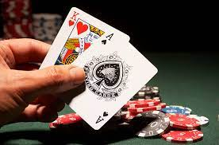

Black Jack is a card game that is usally played in casinos, but what if you cannot go to casino and want to still have the same thrill of playing Black Jack? 
This project allows you to play the game of Black Jack by applying the rules of B lack Jack and prompts the user what they would like to do, this is a single player game that randomly assigns the user a card from the deck.

This project was for an assignment in EE 160 where we had to code a game in C language.This was coded by a gorup of 4 people including me. We tried our best to break up the work evenly. This was project was the first group project I had done. I learned that it's hard to assign each person a part of the project equally without planning out an algorithm first. Due to covid we only communicated over chat and did not communicate over zoom or call either as our schedules did not line up but we were able to make it work. A lot of the time was spent going back and forth between who should which part of the project but throught this first project together we learned what worked. We did not code this in a collabrative idle or space so we often did not communicate well and others would do parts the another had already done. 

After spending a lot of time finding out ways to collaborate with one another we were ableto get the black jack game to work without any syntax errors. This project was assigned to us so we it was difficult to engage in it since we didn't get to have the freedom to choose what kind of game we could code but it was enjoyable learning about the game itself and the rules that the games has. If you would like to try to play a game of black jack please feel free to check out the source link below. 

Source: <a href="https://replit.com/@lindangyuen/Black-jack?v=1#blackjack.c">BlackJack Code</a>
 

