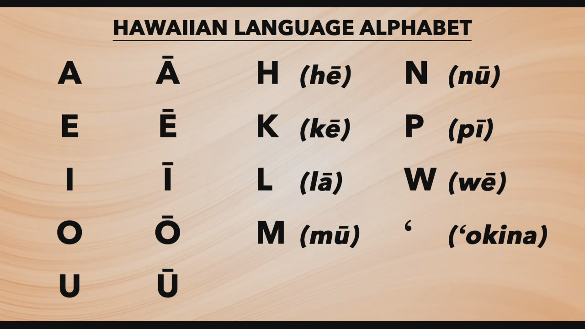

This project was done for a course called programming for engineers or EE160. This course is normally taken by engineers which I was majoring at the time so it mainly covered the foundations of coding that would be helpful to engineers. This program scans an input from the user which can be a string or a character and will tell the user if the string or character that they inputed if it is a Hawai'ian constant,vowel,or if it is unrelated to the Hawai'ian alphabet. It was done in C by three other group members. This project was interesting because it had to do with the Hawai'ian alphabet. 

## Group Work
A challenge my group and I faced was that the ascii table does not have all fo the Hawai'ian characters so we had to find a work around for that, what we did was that we applied general rules that Hawai'ian characters had. This was the same group I worked with previously so our team work had greatly improved from how it was when we first started and we were able to find ways to break up the work evenly. I had written the algorithm for this while the rest of the group broke up the work by functions. 

## Mixing Culture with Coding
It was enjoyable to be able to code about something culturally that every person in thr group could relate to as we all live in Hawai'i. Rather then having a prompt and having to work off of that prompt we were able to code something that related to us personally. Though I'm that there is probably a job coders could do with any of their personal intrests I never thought that I could code a program that was related to the Hawai'ian language.

Source: <a href="https://replit.com/@lindangyuen/Hawaiian-Alphabet?v=1">Hawai'ian Alphabet Checker</a>
