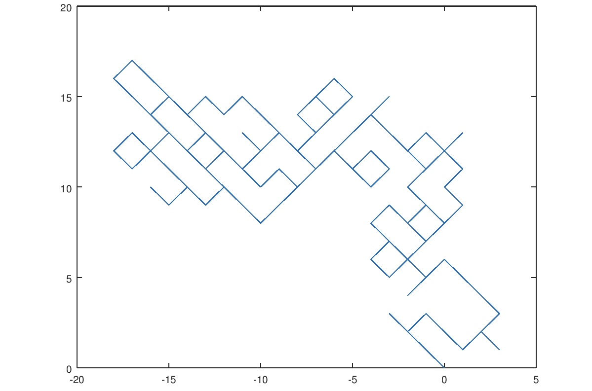

This project was done for a introductory course in java. This is my first Java project and shows what kind of coding skills I had when starting.
I did this project by myself so everything in the source was written by me. Not only was this my first Java project but this was my first solo project. There were a couple of pros and cons from doing a solo project. It was nice that I had complete control over the project but whenever I got stuck I could not get another person to look for a possible work around. 

It is a very simple code that covers the foundation of Java. One roadblock I ran into was finding out how to calculate the coordinates on a plane.

Source: <a href="https://replit.com/@lindangyuen/Mean-Squared-Distance?v=1#Main.java">Random Walker Code</a>
